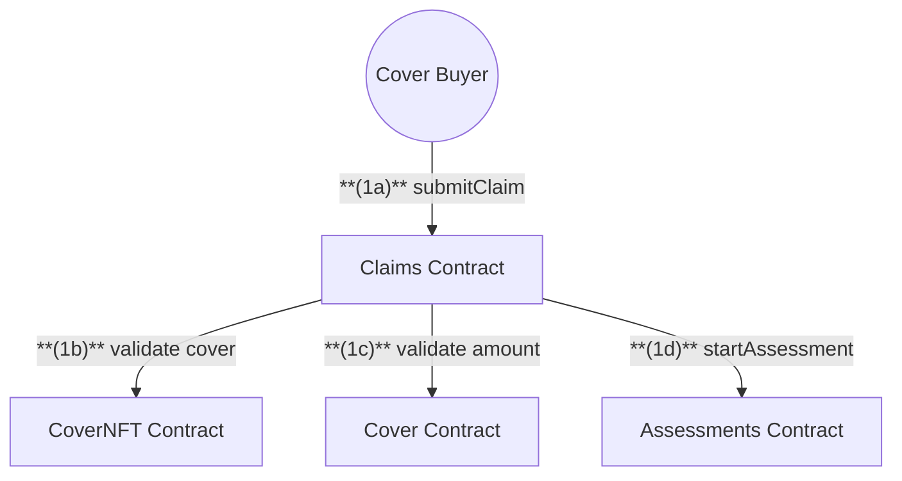
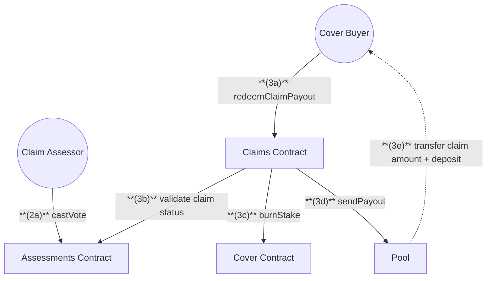

# Claims & Assessments

## 1. Submit Claim Flow

## 2. Assessments & Redemption Flow

## Actions

### Quick Summary:

1. Cover buyers can submit claims and redeem payouts
2. Claim assessors vote on claim validity
3. Approved claims receive payouts in cover asset

### 1. Cover Buyer Actions

1. **Submit Claim**

   - Call `submitClaim` on Claims to request a payout
   - Provide:
     - Cover ID
     - Claim amount
     - Incident date
     - Proof of loss
   - Pay claim assessment deposit in ETH

2. **Redeem Approved Claim**
   - Wait for assessment period to complete
   - If claim is approved, call `redeemClaimPayout` on Claims
   - Receive:
     - Claim amount in cover asset
     - Assessment deposit returned in ETH

### 2. Claim Assessor Actions

1. **Vote on Claims**
   - Call `castVote` on Assessments contract
   - Specify:
     - Claim ID
     - Vote (Accept/Reject)
     - Stake amount
   - NXM stake is locked during voting period

---

## Claim Submission & Processing

1. **Submit Claim**
   **(1a)** `Cover Buyer` calls `submitClaim` on Claims
   **(1b)** `Claims` validates cover ownership via CoverNFT
   **(1c)** `Claims` validates claim amount via Cover
   **(1d)** `Claims` starts assessment process

2. **Assessment Process**
   **(2a)** `Assessors` call `castVote` on Assessments
   **(2b)** `Assessments` records each ballot with the rationale for the decision

3. **Claim Payout**
   **(3a)** `Cover Buyer` calls `redeemClaimPayout` on Claims
   **(3b)** `Claims` validates with Assessments:

   - Assessment period has ended
   - More accept votes than deny votes
   - Cooldown period has passed

   **(3c)** `Claims` calls Cover to burn stake from affected pools
   **(3d)** `Claims` sends payout via Pool
   **(3e)** `Pool` transfers:

   - Claim amount in cover asset
   - Returns assessment deposit in ETH

## Notes

- Claims can be submitted before the grace period ends (cover expiry + grace period days)
- Assessment period has a fixed duration for voting
- Claimant deposits ETH when submitting a claim:
  - Deposit is returned to claimant if claim is approved
  - Deposit is distributed to assessors if claim is rejected
- Approved claims burn staked NXM from affected staking pools
