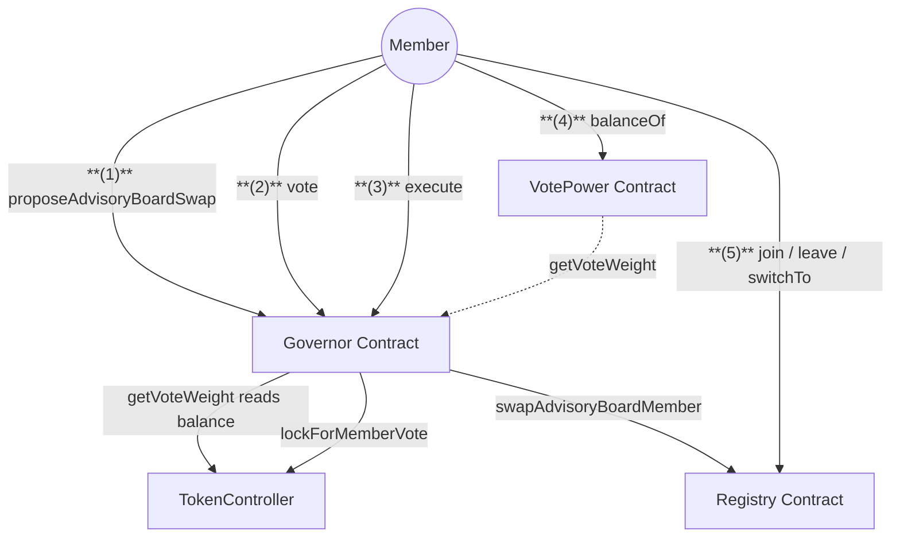
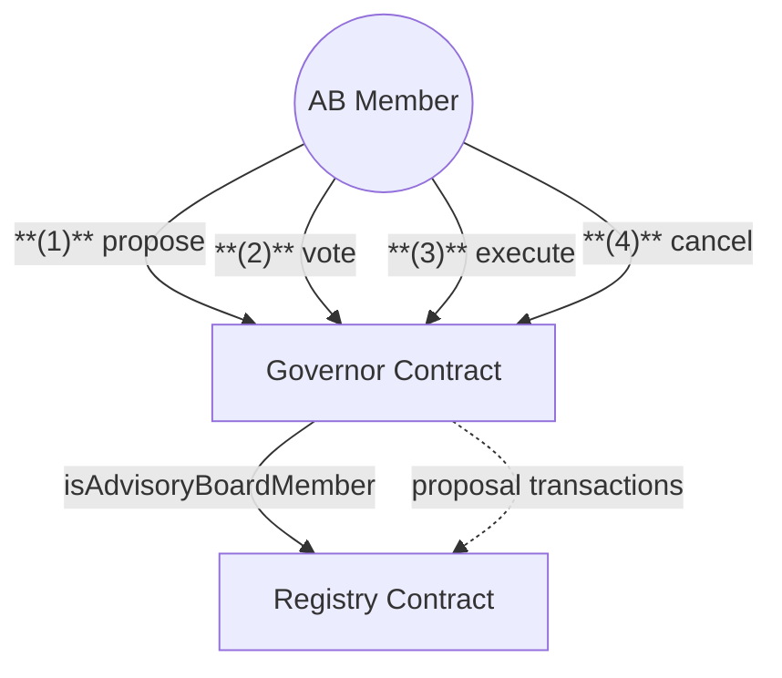

# Governance & Membership Contracts

## 1. Member Flow

## 2. Advisory Board Flow

## Actions

### Quick Summary:

1. The Advisory Board raises proposals carrying the transactions that enact a governance outcome
2. Members raise proposals to replace an Advisory Board member
3. A carried proposal is executed after a 24-hour timelock

### 1. Member Actions

1. **Propose an Advisory Board Swap**

   - **Member** calls `proposeAdvisoryBoardSwap` on Governor with:
     - The AB member to replace and the member to replace them with
     - A description
   - Requires the member to hold more than 99 NXM

2. **Vote on a Proposal**

   - **Member** calls `vote` on Governor with:
     - Proposal ID
     - Choice: For, Against, or Abstain
   - Voting locks the member's NXM transfers until the proposal is executable

3. **Read Voting Power**

   - **Member** calls `balanceOf` on VotePower to check their voting weight
   - Weight is the member's NXM balance plus one, capped at 5% of total supply

4. **Execute a Proposal**

   - **Member** calls `execute` on Governor once the timelock has passed
   - Requires more votes for than against, and 15% of supply to have participated

5. **Join, Leave or Switch Membership**
   - **Member** calls `join`, `leave` or `switchTo` on Registry

### 2. Advisory Board Actions

1. **Raise a Proposal**

   - **AB Member** calls `propose` on Governor with:
     - The transactions to execute
     - A description

2. **Vote on a Proposal**

   - **AB Member** calls `vote` on Governor
   - Each AB member holds one vote, regardless of NXM held
   - Three votes in favour carry the proposal and start the timelock

3. **Execute a Proposal**

   - **AB Member** calls `execute` on Governor once the timelock has passed

4. **Cancel a Proposal**
   - **AB Member** calls `cancel` on Governor
   - Only AB proposals can be cancelled

## Notes

- Members raise and vote on Advisory Board replacements onchain, and vote on all other proposals through the Nexus Mutual DAO Snapshot space
- Voting power is capped at 5% of the total NXM supply
- Voting on a member proposal locks NXM transfers until the proposal is executable
- A 24-hour timelock runs before any carried proposal can be executed
- All contracts resolve addresses through the Registry

## Registry Dependencies

Contracts resolve their dependencies through the Registry, which also holds membership records, the Advisory Board seats and the emergency pause configuration.

- **Governor:** `Registry`, `TokenController`
- **VotePower:** `Registry`, `Governor`, `NXMToken`
